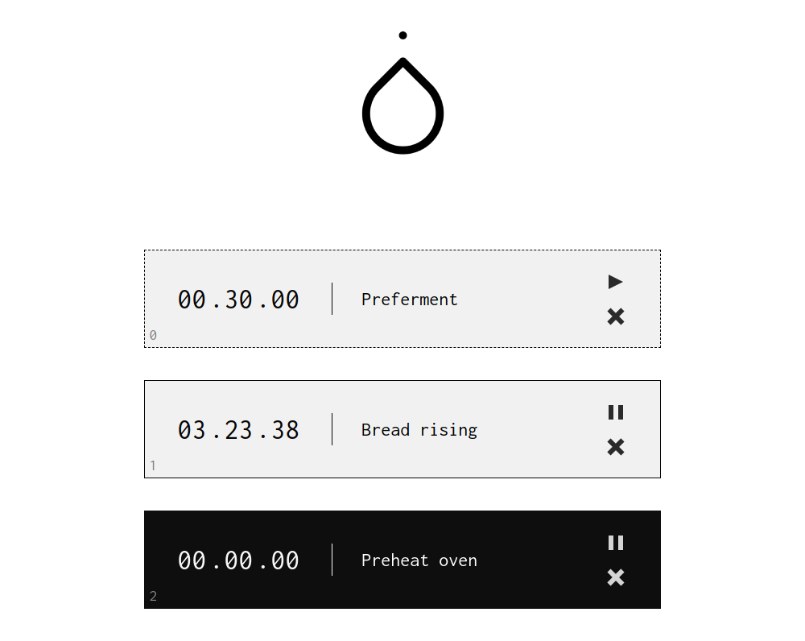

Tíd is a cooking tool, branched off from my previous `multitimer`_ project.
Written in Elm.

Credits
-------

Alarm sound by `original_sound`_.

.. image:: http://scieldas.autophagy.io/licenses/MIT.png
   :target: LICENSE
   :alt: MIT License

.. _multitimer: https://github.com/Autophagy/multitimer
.. _original_sound: https://freesound.org/people/original_sound/sounds/364658/
